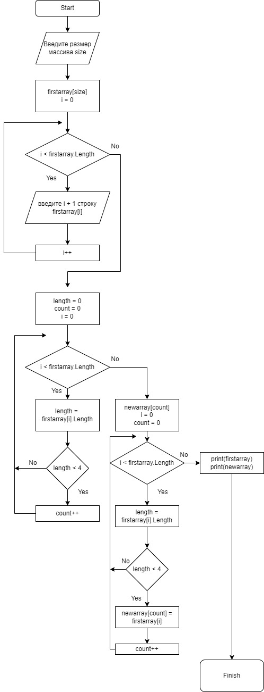

**Контрольная работа**

Текст задания:

1.Создать репозиторий на GitHub

2.Нарисовать блок-схемуалгоритма

3.Снабдить репозиторий оформленным текстовым описанием решения

4.Написать программу

5.Использовать контроль версий

Описание решения:

* Создан репозиторий
* Создана блок-схема
* Снабдили репозиторий оформленным текстовым описанием решения
*  Создана программа решающая данную задачу

    Метод **Firstarray** заполняет исходный массив

    Метод **Newarray** заполняет новый массив

    Метод **Showarray**  выводит массив
* При работе был использован контроль версий

    (Сохранены файлы,
    сделаны коммиты)

*Тут представлена блок-схема программы , которая из имеющего массива строк формирует массив из строк, длина которых меньше либо равна 3:*

